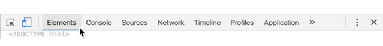
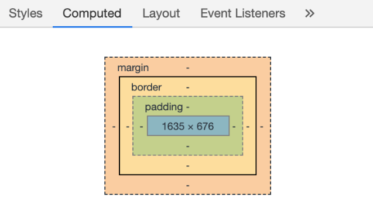
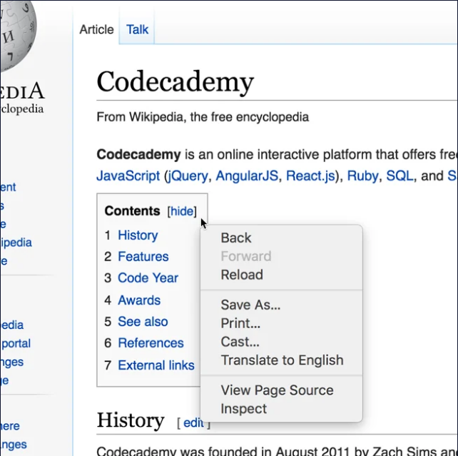
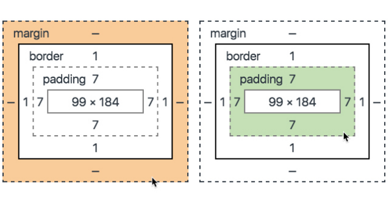

# The Box Model in DevTools

## Introduction
All HTML elements are boxes made up of four components: a content container, padding, border, and margin. In our Box Model lesson, we introduce these four properties and use them to position elements on a website. If you have not taken this lesson, we recommend you do so now before continuing.

In this article, we will introduce how Google Chrome’s DevTools can be used to view the box around each element on a web page.

## 1. View Box Model Dimensions with DevTools
You can use Google Chrome’s DevTools to view the box around every element on a web page. There are a few different ways to open DevTools, depending on your platform:

### Mac
- `command` + `option` + `i`
- View > Developer > Developer Tools
- Chrome 3 dot menu ⋮ > More Tools > Developer Tools

### Windows
- `control` + `shift` + `i`
- F12
- Chrome 3 dot menu ⋮ > More Tools > Developer Tools

Use whichever method works best for you. When you have the DevTools open, navigate to the Elements tab.

**Elements Tab**
In this tab, you can view all of the elements on the current page. From this view, you can select the element of interest, which will open a new column on the right side of DevTools. Select the tab labeled Computed on the top of the rightmost column.

**Computed Tab**
The selected element’s box should appear at the top of the pane. Hovering over each property of the box will cause the property to be highlighted on the web page.

If you know the element you want to inspect, going through all of the steps listed above is unnecessary. Instead, you can right-click the element you want to observe and select the Inspect button. This will display DevTools on the right side of the browser with the element selected in the Elements tab. To view the element’s box, you can select the Computed tab.

If you’d like some more info or a refresher on how to use Google Dev Tools, take a look at this [video](https://www.youtube.com/watch?v=VuQ4pF_hfag).

### Exercise I: View a Website’s Box Model Dimensions
Complete the following steps within the current web browser view.

1. In a new tab, navigate to the Codecademy [Wikipedia](https://en.wikipedia.org/wiki/Codecademy) page.
2. Right-click (or `Ctrl` and click simultaneously) the Contents navigation box displayed in the image below:

3. Select Inspect.
4. Select the Computed tab at the top of the rightmost column.
5. Hover over the different properties of the logo’s box. The corresponding space on the web page should be highlighted when you do this.

## 2. Modify Box Dimensions
Now that you know how to view the box of an element, we’ll modify the box’s values with DevTools.

To modify the values of the box, double-click the property value, assign it a new number, and press enter. You can also adjust the value incrementally by double-clicking the value and using the up or down arrow keys.

**Selecting Values**
In the image above, the border on each side is set to 1, and the padding is set to 7. These values can be changed by double-clicking the values in the box and assigning them new numbers or using the up or down arrow keys on your keyboard.

**Note:** If you inspect an element and find that the border is set to -, adding a numerical value will not make a border appear. The border color, style, and width must be set in the CSS document in order to see the border.

### Exercise II: Modify a Website’s Box Model Dimensions
Pick up where you left off in Exercise 1.

1. Double-click the top padding of the element.
2. Use the up and down arrows to adjust the element’s padding. Observe how the appearance changes on the web page.
3. Change the left margin to 200. Observe how the element’s appearance changes.

Remember, the changes you make in DevTools are not saved. If you are using DevTools to make adjustments to a personal project, make sure to adjust values in the HTML and CSS documents.

## Video: [The Box Model in DevTools](https://youtu.be/uQi8TK-GDO4)