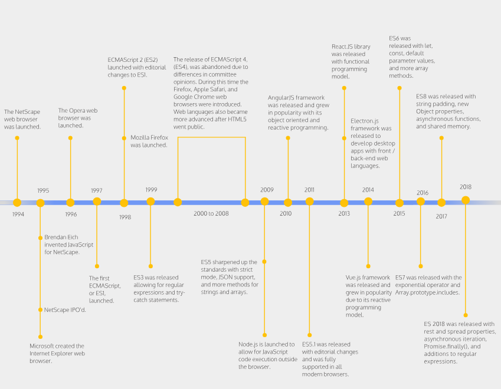

# JavaScript Versions: ES6 and Before

Ever heard of the term “ES6” and wondered what it’s about? Read this article to find out!

You might have seen the term “ES6” or “JavaScript ES6” and wondered what it actually means. Well wonder no further, because we’re going to dive into what ES6 is and how it relates to JavaScript!

## History of JavaScript and ECMAScript

JavaScript was introduced in 1995 by the company Netscape Communications as a scripting language for web designers and programmers to interact with web pages. The next year, Netscape submitted JavaScript to a standards developing organization called Ecma International to create standards for a scripting language (a type of programming language). In 1997, Ecma International released ECMA-262 which sets standards for the first version of a scripting language called ECMAScript, shortened to ES.

These new ECMAScript standards provided rules for the architecture of JavaScript features. As new programming paradigms emerged and developers sought new features, newer versions of ECMAScript provided a basis for consistency between new and old JavaScript versions.

## Understanding ES6

To fully distinguish the difference between JavaScript and ECMAScript: if you want to create an app or program you can use JavaScript — if you want to create a new scripting language you can follow the guidelines in ECMAScript. So, when you see ES6 or JavaScript ES6, it means that that version of JavaScript is following the specifications in the sixth edition of ECMAScript! You might also see ES2015 instead of ES6, but both terminologies are referring to the same 6th edition of ECMAScript that was released in 2015. Take a look at the timeline below to see how JavaScript has evolved over the years:



Now, you may be asking, what makes an update in 2015 still relevant today when there are more recent updates like ES7 and ES8?

Well, despite the release of newer versions, ES6 is actually the biggest update made to ECMAScript since the first edition released in 1997! Some developers even refer to ES6 as “Modern JavaScript” because of all the major additions. There were so many great features added to help JavaScript developers that include:

- New keywords like `let` and `const` to declare variables
- New function syntax using Arrow functions
- Creation of Classes
- Parameters with default values
- Promises for asynchronous actions
- And many more!

Up-to-date browsers now support most of the ES6 features which allow developers to take advantage of these new additions. ES6 ultimately allows programmers to save time and write more concise code. Take for example pre-ES6 syntax for function expressions:

```javascript
var greeting = function() {
  console.log('Hello World!');  
};
```

With ES6 arrow functions, we can transform the expression above into:

```javascript
const greeting = () => console.log('Hello World');
```

However, arrow functions are not just simply syntactical re-writes. As with other ES6 features, there are other underlying benefits and tradeoffs to consider. Nonetheless, there has been a strong adoption of ES6 in the development community. Benefits such as new ES6 syntax, make it easier to utilize a popular programming paradigm, Object Oriented Programming (OOP). With this change, developers in other languages who are used to OOP have a smoother transition into learning and using JavaScript. Another reason for the popularity of ES6 is correlated with the usage of ES6 in popular frameworks like React. So, if you want to learn the newest tools and frameworks, you will have to pick up ES6 along the way.

This being said, we shouldn’t disregard legacy code, i.e. older versions of JavaScript. In fact, there are still many projects that are built and maintained with legacy code! If you want the ability and freedom to work on any sort of JavaScript project, you should familiarize yourself with pre-ES6 and ES6 JavaScript syntax. But don’t worry, we cover both pre-ES6 and ES6 in our JavaScript course. Check it out to become a rockstar at JavaScript basics and learn fundamental programming skills!